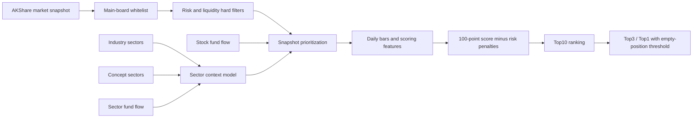

# A股主板短线评分系统设计

## Architecture



## Permanent hard gate

Only account-permitted A-share main-board codes enter scoring:

```text
600*** 601*** 603*** 605*** 000*** 001*** 002***
```

The strategy also hard-filters ST, *ST, delisting-stage, major-risk-notice, weak-liquidity,
low-turnover and low-amount stocks before scoring.

## Score

| Dimension | Points |
| --- | ---: |
| Trend | 40 |
| Volume and turnover | 25 |
| Relative strength | 20 |
| OBV and breakout funds proxy | 15 |

Market condition is reported and weak-market days deduct 5 points from every candidate.
The first-ranked stock must score at least 75, otherwise the report recommends staying
in cash.

## Sector Model

The engine scores both industry and concept boards. Each board receives:

- pct-change rank;
- main-force fund-flow rank;
- heat score based on pct change, board turnover and board amount when available;
- combined sector score.

Sector data is used for context, universe prioritization and relative-strength comparison.
It no longer contributes fixed points or gates the Top3.

## Request optimization

Historical bars are slow public requests. After the main-board whitelist, the engine
prioritizes a configurable number of stocks using snapshot fund flow, combined sector
strength and turnover. Those stocks receive complete daily-bar scoring. The default
scoring universe is 300 stocks and can be expanded later after local caching is implemented.

## Output

Every run outputs Top10, Top3 and Top1. Reports include final score, score breakdown,
buy range, stop loss, target, reasons, risk warnings and the buy/observe/cash decision.

## Roadmap

1. Persist normalized daily bars locally.
2. Replace request prioritization with a cached full-main-board daily scan.
3. Persist market-turnover history.
4. Add intraday confirmation and alerts.
5. Backtest scoring thresholds and score-to-return calibration.
